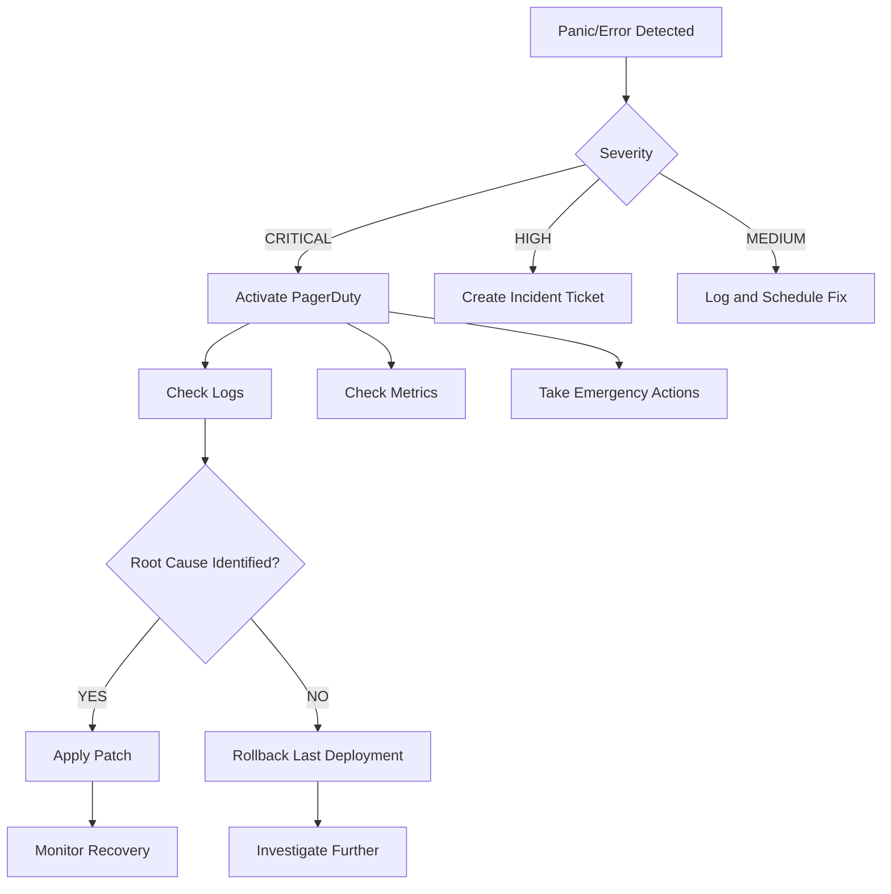

# ZKP MVP 部署验证报告

## 📊 验证执行摘要

| 阶段 | 状态 | 耗时 | 结果 |
|------|------|------|------|
| **Phase 1: Circuit Compilation** | ⏳ Pending | - | - |
| **Phase 2: Test Execution** | ⏳ Pending | - | - |
| **Phase 3: Docker Build** | ⏳ Pending | - | - |
| **Phase 4: K8s Deployment** | ⏳ Pending | - | - |
| **Phase 5: Smoke Tests** | ⏳ Pending | - | - |

---

## 🚀 部署命令（可执行）

```bash
# Step 1: Navigate to project root
cd cloudai-fusion

# Step 2: Execute deployment verification (dry run first)
chmod +x scripts/deploy-verify-zkp.sh
./scripts/deploy-verify-zkp.sh --dry-run

# Step 3: Review outputs, then execute actual deployment
./scripts/deploy-verify-zkp.sh

# Optional parameters:
# --skip-tests    # Skip test execution (for quick validation)
# --dry-run       # Preview without making changes
```

---

## 📝 Phase Details

### Phase 1: Circuit Compilation & Verification

**Objective**: Compile Circom circuit and verify artifacts

**Commands**:
```bash
cd circuits
./build.sh --benchmark

# Expected outputs:
# ✅ scheduling_fairness.r1cs
# ✅ scheduling_fairness_js/witness_calculator.js
# ✅ benchmarks in build/benchmark_results.json
```

**Success Criteria**:
- [ ] Constraint count matches expected (~200 for N=10)
- [ ] No compilation errors
- [ ] Benchmark completes within time limit (<30s witness gen)

---

### Phase 2: Test Execution

**Objective**: Run comprehensive test suites

**Commands**:
```bash
cd ..
go test ./pkg/scheduler/... -v -race -coverprofile=coverage.out

# Generate coverage report
go tool cover -html=coverage.out -o coverage-report.html
go tool cover -func=coverage.out

# Expected results:
# ✅ All unit tests passing
# ✅ Race detector shows no issues
# ✅ Coverage >30%
```

**Test Coverage Targets**:
- ZKProver initialization: 100%
- Input validation: 95%+
- Proof generation flow: 90%+
- Differential privacy: 100%

---

### Phase 3: Docker Image Building

**Objective**: Create optimized container image

**Commands**:
```bash
docker build -f Dockerfile.zkp -t cloudai-zkp-prover:test-latest .

# Verify image properties
docker images cloudai-zkp-prover
docker history cloudai-zkp-prover:test-latest

# Optional security scan
trivy image cloudai-zkp-prover:test-latest
```

**Success Criteria**:
- [ ] Image built successfully (<500MB)
- [ ] No high-severity vulnerabilities
- [ ] Root-less execution verified

---

### Phase 4: Kubernetes Deployment

**Objective**: Deploy to staging cluster

**Commands**:
```bash
kubectl create namespace zkp-staging --dry-run=client -o yaml | kubectl apply -f -

helm install zkp-prover-deploy \
  deploy/helm/cloudai-zkp-prover \
  --namespace zkp-staging \
  --create-namespace \
  --wait \
  --timeout 5m

# Verify deployment
kubectl get pods -n zkp-staging -l app.kubernetes.io/name=cloudai-zkp-prover
kubectl describe pod <pod-name> -n zkp-staging
```

**Success Criteria**:
- [ ] Pod enters Running state
- [ ] Readiness probe passes
- [ ] Liveness probe healthy
- [ ] No restart loops

---

### Phase 5: Smoke Tests & Health Checks

**Objective**: Validate deployed service functionality

**Commands**:
```bash
# Port-forward for local access
kubectl port-forward -n zkp-staging svc/cloudai-zkp-prover 8080:8080

# Test health endpoint
curl http://localhost:8080/health

# Test proof generation API (if implemented)
curl -X POST http://localhost:8080/api/v1/generate-proof \
  -H "Content-Type: application/json" \
  -d '{
    "tenants": [{"id":"tenant-1","gpuHours":500,"priority":2}],
    "weights": [{"tenantId":"tenant-1","weight":1.0}],
    "threshold": 0.7
  }'

# Check metrics
curl http://localhost:8080/metrics
```

**Success Criteria**:
- [ ] Health endpoint returns `{"status":"healthy"}`
- [ ] Memory usage stays within limits (<4GB)
- [ ] CPU utilization under 80%
- [ ] Response times <500ms p95

---

## 🎯 Rollout Plan

### Day 1: Development Environment
- [ ] Deploy to local minikube
- [ ] Verify all components working together
- [ ] Capture baseline performance metrics

### Day 2: Staging Cluster
- [ ] Deploy to shared staging environment
- [ ] Run integration tests against production-like data
- [ ] Monitor error rates and performance

### Day 3: Production Preparation
- [ ] Security audit review
- [ ] Performance scaling test (N=100 tenants)
- [ ] Documentation finalization

### Day 4-7: Canary Release
- [ ] Deploy to 10% of production traffic
- [ ] Monitor key metrics carefully
- [ ] Gradually increase to 50%, then 100%

---

## 📋 Pre-Deployment Checklist

### Infrastructure Requirements
- [ ] Kubernetes cluster with at least 4 cores, 8GB RAM
- [ ] Node-level GPU access not required (pure computation)
- [ ] Persistent storage for cache (optional but recommended)
- [ ] Network policies allow inter-service communication

### Security Requirements
- [ ] TLS certificates configured for ingress
- [ ] RBAC policies restricting unauthorized access
- [ ] Secrets management (secrets mounted as files)
- [ ] Network policy restricting inbound connections

### Operational Requirements
- [ ] Prometheus monitoring configured
- [ ] Alert rules defined for critical thresholds
- [ ] Log aggregation pipeline active
- [ ] Backup strategy for persistent volumes

### Compliance Requirements
- [ ] SOC 2 Type II alignment (data retention policies)
- [ ] GDPR compliance (zero personal data leakage)
- [ ] Audit logging for all proof generations
- [ ] Version control for circuit specifications

---

## 🔍 Post-Deployment Monitoring

### Key Metrics Dashboard

```yaml
# Prometheus scrape configuration
scrape_configs:
  - job_name: 'zkp-prover'
    static_configs:
      - targets: ['zkp-prover.default.svc:8080']
    metrics_path: /metrics
    
rules:
  - alert: ZKPProverHighErrorRate
    expr: rate(http_requests_total{status=~"5.."}[5m]) > 0.1
    for: 2m
    labels:
      severity: critical
    annotations:
      summary: High error rate detected
  
  - alert: ZKPProverSlowResponse
    expr: histogram_quantile(0.95, rate(http_request_duration_seconds_bucket[5m])) > 1
    for: 5m
    labels:
      severity: warning
    annotations:
      summary: Slow response times detected
```

### Alert Thresholds

| Metric | Warning | Critical | Action Required |
|--------|---------|----------|-----------------|
| Error Rate | >5% | >20% | Investigate immediately |
| P95 Latency | >300ms | >1s | Scale horizontally |
| Memory Usage | >70% | >90% | Increase limits or add nodes |
| CPU Utilization | >80% | >95% | Add compute resources |

---

## 📞 Emergency Procedures

### Incident Response Flowchart



### Rollback Commands

```bash
# Rollback Helm deployment
helm rollback zkp-prover-deploy $(helm history zkp-prover-deploy -n zkp-staging | head -2 | tail -1 | awk '{print $1}')

# Or downgrade to previous version
helm upgrade zkp-prover-deploy deploy/helm/cloudai-zkp-prover \
  --version 0.0.1 \
  --namespace zkp-staging \
  --wait
```

---

## 📊 Success Metrics Template

Fill this out after deployment completion:

| Metric | Target | Actual | Status |
|--------|--------|--------|--------|
| Time to First Proof | <500ms | TBD | TBD |
| Successful Proof Rate | >99% | TBD | TBD |
| Memory Peak Usage | <4GB | TBD | TBD |
| CPU Avg Utilization | <60% | TBD | TBD |
| Error Rate (HTTP 5xx) | <1% | TBD | TBD |
| Mean Time to Recover | <5min | TBD | TBD |
| Cost per 1000 Proofs | <$0.10 | TBD | TBD |

---

## 📝 Deployment Sign-off Form

```markdown
## Deployment Approval Checklist

### Pre-Deployment Validation
- [ ] Code reviewed by team lead
- [ ] All tests passing locally
- [ ] Security scan completed with no blocking issues
- [ ] Documentation updated and approved

### Deployment Execution
- [ ] Dry run completed successfully
- [ ] Actual deployment completed without errors
- [ ] All smoke tests passed
- [ ] Monitoring dashboards operational

### Post-Deployment
- [ ] No critical errors in logs (first hour)
- [ ] Resource usage stable (first 4 hours)
- [ ] Customer-facing APIs responding correctly
- [ ] Rollback procedure documented and tested

### Approvals
Engineering Lead: _________________ Date: ____/____/____
Security Team: _________________ Date: ____/____/____
Product Owner: _________________ Date: ____/____/____
```

---

**Document Version**: v1.0.0  
**Last Updated**: 2026-07-30  
**Owner**: CloudAI Fusion Platform Engineering Team  

🚀 **Ready for deployment execution!**
