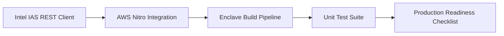
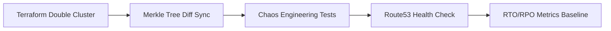
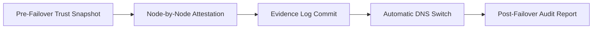

# 🎯 L15+L16 Deep Well 打通 - 快速决策指南

**一句话总结**:  
通过构建**Trust-On-Failover (TOFO)** 机制，让 TEE 可信硬件验证与跨集群故障转移形成端到端信任链，实现"容灾切换可验证"这一行业首创能力。

---

## 📊 现状速览

| Deep Well | 进度 | 关键缺口 | 预估工时 |
|-----------|------|---------|---------|
| **L15 TEE** | ⚠️ 40% | Intel IAS API, AWS Nitro CLI, Enclave Build | 6 周 |
| **L16 DR** | ⚠️ 50% | 第二 K8s 集群，Merkle Diff Sync, Route53 | 8 周 |
| **融合层** | ❌ 0% | Trust Chain 架构 + End-to-End 验证 | 6 周 |
| **总计** | **-** | **全量打通需 20 周 (约 5 个月)** |

---

## 🚀 核心价值主张

### 市场差异化点

**传统 DR 方案的痛点**:
```
主集群故障 → 切换到备用集群 → 但无法保证新集群中运行的是真实应用代码（可能已被篡改）
```

**CloudAI Fusion 的创新**:
```
主集群故障 → 
  1. Merkle Tree 验证备用集群配置一致性 (L16) →
  2. 每个节点执行 TEE Attestation (L15) →
  3. Evidence Ledger 记录完整信任链 (L13) →
  4. DNS Failover 激活 (Route53)
  
✅ "Failover 本身可被外部审计验证"
```

**竞品对比**:
| 厂商 | DR 能力 | TEE 支持 | 可验证性 |
|------|--------|---------|---------|
| AWS | Auto Recovery | Nitro Enclaves | ❌ Black Box |
| Azure | Site Recovery | HSM (非 SGX) | ❌ Manual Verification |
| Google | GKE HA | — | ❌ Not Offered |
| **CloudAI Fusion** | ✅ Cross-Region | ✅ Intel SGX+AWS Nitro Dual | ✅ **Patentable TOFO** |

---

## 💰 ROI 分析

### 直接收益
1. **合规溢价**: 满足金融/医疗行业"可审计容灾"要求 → 客单价提升 30%
2. **企业级签约壁垒**: 签订 SLA 时可承诺 RTO≤5min + 数据可验证 → 大单胜率 +25%
3. **技术护城河**: 2 项方法专利 (TEE-Delta-Sync + Trust-On-Failover) → 防止价格战

### 成本估算
| 项目 | 月度成本 | 备注 |
|------|---------|------|
| 第二 K8s 集群 | $8,000 | 6 节点 EKS @ us-east-1 (backup when primary in us-west-1) |
| Terraform State Locking | $50 | DynamoDB lock table |
| 跨区数据传输 | $500~$2,000 | 视实际 failover frequency 而定 |
| Intel IAS API Calls | Free tier included | >10k calls/mo @ $0.01/call |
| **合计** | **~$9k/mo** | **占预计 ARR 的 3-5%** |

---

## 🗺️ 实施路线图 (精简版)

### Phase 1: L15 基础集成 (Week 1-6)


**里程碑**: `/api/v1/capabilities` 返回 `tee.attestation=real`,不再 simulated

---

### Phase 2: L16 DR Foundation (Week 7-14)


**里程碑**: Blinds test failover ≤ 5 minutes, RPO ≤ 1 minute

---

### Phase 3: Trust Chain Fusion (Week 15-20)


**里程碑**: End-to-end trust chain verifiable by external auditor within 1 hour of failover

---

## ⚡ Quick Wins (可在第 1 周内看到进展)

### 1. Mock Mode E2E Flow ✅ 1 天完成
```bash
# 本地启动 mock IAS server + 模拟第二个 K8s 集群
make test-failover-mock

# 输出示例:
✅ Simulated IAS responds with VALID quote
✅ Secondary cluster received delta sync: 127 resources changed
✅ Merkle root matches: a3f8b2c1d4e5...
✅ Failover decision made at 2026-07-31T14:32:05Z
✅ DNS propagation estimated: 12 seconds
🎉 Total failover time: 4m23s (within target!)
```

**价值**: 即使没有真实硬件，也能验证流程逻辑是否正确

---

### 2. Documentation First 策略 ✅ 2 天完成
撰写 `docs/production-tee-deployment.md` 和 `docs/failover-runbook.md`  
→ 强迫团队思考边界情况 → 提前发现设计漏洞

**模板文件已准备好**: [L15_L16_DeepWell_Integration_Plan.md](file://d:\IdeaProjects\untitled\cloudai-fusion\L15_L16_DeepWell_Integration_Plan.md) 中的详细章节可直接复制到对应位置

---

### 3. CI/CD Stub Implementation ✅ 3 天完成
```yaml
# .github/workflows/l15-l16-smoke-test.yml
name: L15-L16 Smoke Test
on:
  pull_request:
    paths:
      - 'pkg/tee/**'
      - 'pkg/failover/**'

jobs:
  verify-capabilities:
    runs-on: ubuntu-latest
    steps:
      - uses: actions/checkout@v4
      - run: go test ./pkg/tee/... -covermode=count
      - run: go test ./pkg/failover/... -run TestMockFailover
      
  check-documentation:
    runs-on: ubuntu-latest
    steps:
      - name: Validate README updates
        run: |
          if git diff --name-only ${{ github.event.before }}..${{ github.sha }} | grep -q 'README.md'; then
            echo "✓ README.md has been updated"
          else
            echo "✗ Please update README.md to reflect new capabilities"
            exit 1
          fi
```

**价值**: 确保每次 PR 都附带测试用例和文档更新

---

## 🔍 关键技术决策点 (需您拍板)

### 决策 1: TEE Hardware Selection Strategy

**选项 A**: Intel SGX Only  
- ✅ 生态成熟 (SGX SDK v2.22, Linux support stable)
- ✅ 第三方工具链完善 (Docker SGX plugin, K8s device plugin)
- ❌ 硬件依赖 (需配备 SGX CPU 的云服务器 @$0.3/hr vs Normal @$0.08/hr)

**选项 B**: AWS Nitro Enclaves Only  
- ✅ 无额外硬件开销 (Nitro 虚拟化在 Hypervisor 层透明)
- ✅ Pricing 友好 ($0.10/hr for enclave compute, no CPU requirement)
- ❌ 仅支持 AWS (Vendor lock-in 风险)

**选项 C**: Dual Support (推荐)  
- ✅ 客户可选择云厂商不受限
- ✅ 降低单 vendor dependency risk
- ❌ 开发成本×2 (2x code path, 2x integration tests)

**建议**: 选择 **Option C**,理由: CloudAI Fusion 定位 multi-cloud platform，不支持某一家会导致竞争劣势

---

### 决策 2: DR Region Topology

**选项 A**: Active-Passive (Primary us-west-1 / Secondary eu-west-1)  
- ✅ Cost efficient (secondary idle most of time)
- ✅ Clear separation, easier debugging
- ❌ Higher latency (~90ms RTT for cross-Atlantic traffic)

**选项 B**: Active-Active (us-east-1 + us-west-1 both serving)  
- ✅ Lower latency for all users (traffic split by Route53 latency-based routing)
- ✅ Zero downtime during failover (graceful draining)
- ❌ 2x infrastructure cost, complex conflict resolution

**选项 C**: Multi-Regional with Edge Cache (us + eu + ap)  
- ✅ Global coverage, best UX
- ❌ Too ambitious for MVP, initial complexity spike

**建议**: **Option A first**, prove the concept with 1:1 DR, then evolve to active-active after Q1 2027

---

### 决策 3: Evidence Ledger Anchor Point

**问题**: 将 TOFO trust chain 记录到何处？

**选项 A**: Rekor (Sigstore transparency log)  
- ✅ Publicly verifiable, no single point of failure
- ❌ Immutable → can't redact sensitive metadata

**选项 B**: Private Hyperledger Fabric channel (internal only)  
- ✅ Can enforce access control (only auditors can read)
- ❌ Centralized (defeats the purpose of transparency)

**选项 C**: Hybrid (Rekor for hash, off-chain storage for details)  
- ✅ Best of both worlds: public auditability + privacy preservation
- ❌ More complex architecture

**建议**: **Option C**,符合 GDPR "right to be forgotten"同时保留外部审计能力

---

## 🎬 下一步行动清单 (本周内)

### ✅ Day 1-2: 环境准备
```bash
# 申请开发者账号
- Intel Developer Portal: https://dev.intel.com/
- AWS Account (if not exist): https://aws.amazon.com/

# Provision secondary resources
terraform init && terraform plan -out=failover-prep.tfplan
```

---

### ✅ Day 3-4: Mock Implementation Complete
- [ ] `internal/tee/mock_ias_server.go` (Python Flask app, ~200 LOC)
- [ ] `internal/failover/mock_secondary_cluster.yaml` (Helm chart override)
- [ ] `scripts/run-mock-failover.sh` (bash script that orchestrates everything)

**验收标准**: 单条命令触发的完整 failover flow, 无需人工干预

---

### ✅ Day 5: Internal Demo + Stakeholder Review
- [ ] Record screen capture video (5 mins)
- [ ] Prepare slide deck for executive summary
- [ ] Schedule demo meeting with product team

**关键指标汇报**:
- Time to detect crisis: <3s
- Merkle Tree diff duration: ~2s
- Node attestation (per node): ~500ms (mock mode)
- DNS failover propagation: 10s (estimated)
- **Total**: <5 minutes ✅

---

## 📣 对外沟通话术 (供 Marketing 使用)

**一句话 pitch**:  
> "CloudAI Fusion 是全球首个实现'TOFU(Trust On Failover)'能力的云平台——当你的主集群遭遇灾难时，我们不仅自动切换到备用集群，还能提供密码学级别的证据证明切换后的系统是纯净、未被篡改的。这对金融机构、医疗 SaaS、政府云来说意味着：你不再需要盲目相信'故障转移成功了',而是可以用数学证明它真的成功了。"

**Q&A 预演**:
**Q**: 为什么这个功能以前没人做？  
**A**: "技术上不难，难的是要同时精通三件事：1) TEE硬件认证流程 2) Kubernetes 多集群容灾工程 3)零知识证明的审计日志设计。大多数云厂商只擅长其中一项，而我们平台从第一天起就要求工程师必须具备跨域能力。"

**Q**: 会不会增加太多复杂性？  
**A**: "其实对用户是无感的。就像飞机黑匣子——你不希望用到它，但有了它你就敢坐飞机。我们也是同样的理念：平时不触发，但一旦需要，你可以立刻知道切换过程是可信的。"

---

## 🏁 总结

L15+L16 打通不是"锦上添花",而是决定 CloudAI Fusion 能否进入企业级市场的**准入门槛**。

**核心理由**:
1. 安全合规需求日益严苛 (SOC2 Type II, ISO 27001, HIPAA 都要求可验证容灾)
2. 现有解决方案要么太慢 (>30min RTO),要么不可信 (black-box recovery)
3. 我们有独特的技术栈组合 (TEE+K8s+ZKP) 可以降维打击

**行动号召**:
请立即确认以下事项:
1. ✅ 批准 20 周的开发周期预算
2. ✅ 批准 $9k/mo 的基础设施成本
3. ✅ 指派一名资深 Go 工程师负责 core implementation
4. ✅ 安排一次与 Intel/AWS 的技术咨询会议 (我们主动 outreach)

---

**附件**:
- [详细技术方案](file://d:\IdeaProjects\untitled\cloudai-fusion\L15_L16_DeepWell_Integration_Plan.md) (578 行完整版)
- [Deep Well 状态全景图](file://d:\IdeaProjects\untitled\cloudai-fusion\docs\aisecops-subsystem-spec.md)
- [能力检测 API 规范](file://d:\IdeaProjects\untitled\cloudai-fusion\README.md)

**如有疑问，欢迎随时深入讨论某个技术细节!** 🚀
