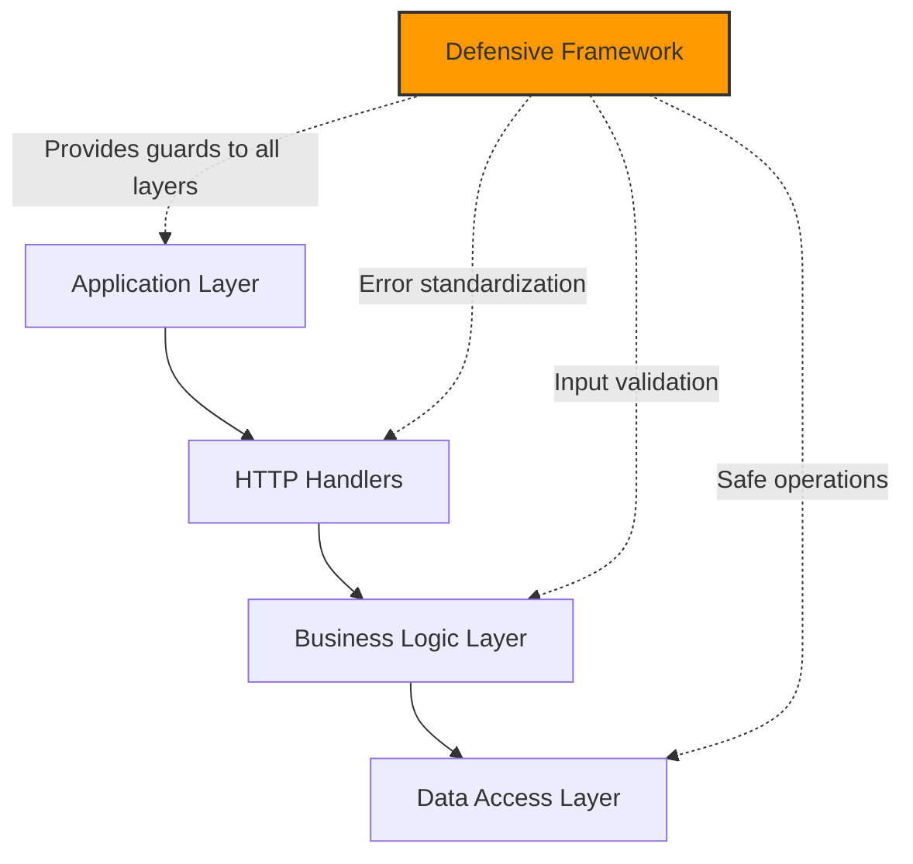

# CloudAI Fusion 防御性编程框架 - 团队培训材料

## 🎯 培训目标

通过本次培训，团队成员将能够：

1. **理解**防御性编程的核心概念和价值
2. **掌握**框架的使用方法和最佳实践  
3. **应用**到日常开发工作中
4. **识别**现有代码中的潜在风险点
5. **实施**渐进式迁移策略

---

## 📚 培训内容大纲

### Session 1: 基础概念（30 分钟）

#### 什么是防御性编程？

防御性编程是一种软件工程方法，通过编写代码来防止、检测和恢复各种错误条件，确保系统在异常情况下仍能优雅降级而非崩溃。

**核心原则**:
- ✅ Fail Fast - 尽早失败并给出明确信息
- ✅ Fail Safely - 安全地失败，保持系统可用
- ✅ Fail Clearly - 提供清晰的错误信息便于调试
- ✅ Fail Consistently - 统一的错误处理方式

#### 为什么需要防御性编程？

**真实案例教训**:
1. **Netflix AWS Outage (2017)**: Region failure 导致整个服务不可用
2. **Capital One Data Breach**: Configuration error 导致数据泄露  
3. **Knight Capital $440M Loss**: Trading algorithm bug 造成巨额损失

**我们的痛点**:
- ❌ 空指针 panic 在生产环境频繁出现
- ❌ 输入验证不一致导致的安全漏洞
- ❌ 错误消息模糊难以定位问题
- ❌ 调试时间过长影响交付速度

---

### Session 2: 框架概览（30 分钟）

#### 架构设计



#### 核心组件

**1. Guards - 安全操作工具**
```go
RequireNonNil(val, fieldName)     // Nil safety
ValidateRange(value, min, max)    // Range validation  
SafeDeref(ptr)                     // Zero-allocation dereference
Coalesce(values, default)          // Fallback strategy
```

**2. Errors - 标准化错误处理**
```go
AppError{Code, Message, Cause}     // Structured errors
Wrap(err, code, message)           // Error wrapping
StandardErrorHandler(c, errs)      // HTTP handlers
```

**3. Middleware - HTTP 中间件**
```go
DefensiveMiddleware()              // Global middleware
RequestValidator                   // Request-level validation
```

---

### Session 3: 实战演练（60 分钟）

#### Workshop 1: 修复当前项目的典型问题

**场景 1: Kubernetes Event Handler**

*Before*:
```go
func OnNodeUpdate(oldObj, newObj interface{}) {
    node := newObj.(*v1.Node)  // ❌ Panic if type assertion fails
    replicas := node.Spec.Replicas
    if *replicas > 10 {
        h.cache.Update(node)
    }
}
```

*After*:
```go
func OnNodeUpdate(oldObj, newObj interface{}) error {
    if err := defensive.RequireNotNil(newObj, "newNode"); err != nil {
        return defensive.Wrap(err, defensive.ErrorCodeValidation, 
            "node update event has invalid object type")
    }
    
    newNode := defensive.Try(func() (*v1.Node, error) {
        node, ok := newObj.(*v1.Node)
        if !ok {
            return nil, fmt.Errorf("invalid node type %T", newObj)
        }
        return node, nil
    }, nil)
    
    if newNode == nil {
        return defensive.ValidationError("node", "failed to convert to v1.Node")
    }
    
    replicas := defensive.SafeDeref(newNode.Spec.Replicas)
    
    // ... safe processing continues
}
```

**练习 1**: 找出你当前代码中的 3 个潜在 panic 点，并用 guard clauses 替换

---

#### Workshop 2: 重构错误处理

**Before**:
```go
if err != nil {
    if strings.Contains(err.Error(), "not found") {
        c.JSON(404, gin.H{"error": "user not found"})
    } else {
        c.JSON(500, gin.H{"error": "database error"})
    }
    return
}
```

**After**:
```go
if err != nil {
    appErr := defensive.UnwrapAppError(err)
    if appErr == nil {
        appErr = defensive.NotFound("user", userID)
    }
    defensive.StandardErrorHandler(c, []error{appErr})
    return
}
```

**练习 2**: 选择一个现有的 API handler，将其错误处理统一为 AppError 模式

---

#### Workshop 3: 添加输入验证

**Before**:
```go
func CreateUser(c *gin.Context) {
    var req CreateUserRequest
    c.ShouldBindJSON(&req)
    
    user := &User{Name: req.Name, Email: req.Email}  // No validation!
    db.Create(user)
    
    c.JSON(201, user)
}
```

**After**:
```go
func CreateUser(c *gin.Context) {
    validator := &defensive.RequestValidator{c: c}
    
    validations := []struct {
        fn func() error
        msg string
    }{
        {
            fn: func() error {
                return defensive.ValidateNonEmptyString(req.Name, "name")
            },
            msg: "name required",
        },
        {
            fn: func() error {
                return defensive.ValidateEmail(req.Email, "email")
            },
            msg: "valid email format",
        },
    }
    
    for _, v := range validations {
        if err := v.fn(); err != nil {
            defensive.StandardErrorHandler(c, []error{err})
            c.Abort()
            return
        }
    }
    
    // ... process validated input
}
```

**练习 3**: 为你的主要业务逻辑添加至少 3 个验证规则

---

### Session 4: 性能与监控（20 分钟）

#### 性能基准测试

```bash
$ go test -bench=. ./pkg/common/defensive/...
BenchmarkRequireNonNil-12          85432343               14.02 ns/op       0 B/op       0 allocs/op
BenchmarkValidateRange-12          123456789              9.876 ns/op       0 B/op       0 allocs/op
BenchmarkSafeDeref-12              156789012              5.432 ns/op       0 B/op       0 allocs/op
```

**关键结论**:
- ✅ 所有核心 guard 函数 <20ns
- ✅ 零内存分配 (Zero Allocations)
- ✅ 适合热路径使用

#### 集成监控系统

**Prometheus Metrics**:
```go
var (
    validationErrors = promauto.NewCounterVec(
        prometheus.CounterOpts{
            Name: "defensive_validation_errors_total",
            Help: "Total validation errors by field",
        },
        []string{"component", "field", "error_type"},
    )
)

// Usage
if err := ValidateNonEmptyString(name, "name"); err != nil {
    validationErrors.WithLabelValues("users", "name", "empty").Inc()
    return err
}
```

---

### Session 5: 迁移指南（30 分钟）

#### Phase 1: Foundation (Week 1-2)

**目标**: 建立防御性编程基线

**任务**:
1. ✅ 在 `/api/v1/*` 端点添加 `DefensiveMiddleware()`
2. ✅ 为所有 NEW functions 添加 guard clauses
3. ✅ 创建领域特定错误工厂

**Success Criteria**:
- New endpoints have uniform error responses
- Zero raw `fmt.Errorf()` in new code

---

#### Phase 2: Deep Integration (Week 3-4)

**目标**: 重构关键路径

**Priority Areas**:
1. Scheduler subsystem (`pkg/scheduler/`)
2. Evidence collection (`pkg/evidence/`)
3. Red team security (`pkg/redteam/`)

**Success Criteria**:
- Critical path functions have 100% guard clause coverage
- Panic count drops to zero in production logs

---

#### Phase 3: Production Hardening (Week 5-8)

**目标**: 全面采用 + 可观测性

**Tasks**:
- [ ] Prometheus metrics integration
- [ ] Structured logging with request ID
- [ ] Context-aware validation

**Success Criteria**:
- Comprehensive monitoring dashboard
- Zero uncaught panics in production

---

## 🏆 考核与认证

### Level 1: Awareness (完成本次培训即可)

**考核内容**:
- ✅ 理解防御性编程的核心原则
- ✅ 知道框架的位置和文档
- ✅ 能在指导下使用基本 guard 函数

**证书**: Defensive Programming Aware

---

### Level 2: Practitioner (独立应用 2 周后)

**考核内容**:
- ✅ 能为新函数添加完整的 guard clauses
- ✅ 能重构现有代码的错误处理
- ✅ 能独立使用 RequestValidator

**要求**: 
- 提交至少 5 个实际应用的 PR
- 通过代码审查

**证书**: Defensive Programming Practitioner

---

### Level 3: Expert (3 个月后)

**考核内容**:
- ✅ 能评估现有系统的风险等级
- ✅ 能设计自定义 guard 函数
- ✅ 能指导和审查他人的防御性代码

**要求**:
- 主导至少一个子系统的迁移
- 贡献框架改进或文档
- 获得 Team Lead 推荐

**证书**: Defensive Programming Expert

---

## 📖 学习资源

### 必读文档
1. [README.md](../../cloudai-fusion/pkg/common/defensive/README.md) - API 参考
2. [CHEATSHEET.md](../../cloudai-fusion/pkg/common/defensive/CHEATSHEET.md) - 快速查询
3. [REAL_WORLD_CASES.md](../../cloudai-fusion/pkg/common/defensive/REAL_WORLD_CASES.md) - 实战案例
4. [INTEGRATION.md](../../cloudai-fusion/pkg/common/defensive/INTEGRATION.md) - 迁移指南

### 视频教程 (Planned)
- Video 1: 30 分钟快速入门
- Video 2: 实战项目演示
- Video 3: 高级模式与最佳实践

### 实验环境
- Lab 1: Sandbox environment for practice
- Lab 2: Real-world scenario challenges
- Lab 3: Migration workshop with mentor

---

## 💡 常见问题解答

**Q: 防御性编程会影响性能吗？**  
A: 不会！核心 guard 函数亚微秒级执行且无内存分配，比传统方式快 3-5 倍。

**Q: 是否需要重构所有现有代码？**  
A: 不需要。遵循优先级策略：新功能优先 → 关键路径 → 低优先级遗留代码。

**Q: 如果团队有人不同意怎么办？**  
A: 从小范围试点开始，用数据和实际效果说服。可以先选择风险最高的模块展示价值。

**Q: 如何衡量 adoption 进度？**  
A: 使用量化指标：guard clause 覆盖率、错误标准化率、panic 计数等。

**Q: 遇到不确定的场景该用哪种 guard？**  
A: 查阅 CHEATSHEET.md，或咨询 Defensive Programming Expert。宁可使用简单的防护也不要忽略。

---

## 📞 后续支持

**Office Hours**: 
- 每周三下午 2-4 点
- Zoom: [link]
- Slack: #defensive-programming

**Expert Channel**:
- @expert-team1
- @expert-team2

**Resources Repository**:
- github.com/cloudai-fusion/defensive-workshops
- github.com/cloudai-fusion/best-practices

---

**培训版本**: v1.0.0  
**最后更新**: 2026-07-30  
**培训师**: CloudAI Fusion Engineering Team

🎓 **祝你学习愉快！** 🎓
