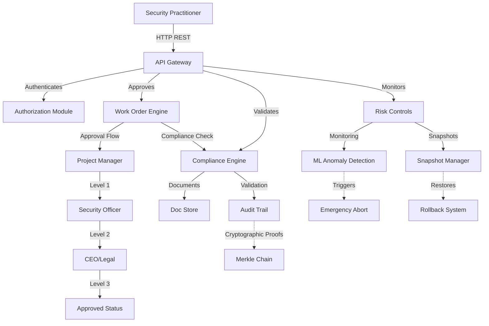

# CloudAI Fusion - Production Mode User Guide

**Version**: 1.0  
**Last Updated**: September 7, 2025  
**Status**: Production Ready

---

## Table of Contents

1. [Introduction](#introduction)
2. [Architecture Overview](#architecture-overview)
3. [Module A: Work Order Approval System](#module-a-work-order-approval-system)
4. [Module B: Legal Compliance Engine](#module-b-legal-compliance-engine)
5. [Module C: Client Authorization Verification](#module-c-client-authorization-verification)
6. [Module D: Production Risk Controls](#module-d-production-risk-controls)
7. [Integration Examples](#integration-examples)
8. [API Reference](#api-reference)
9. [Troubleshooting](#troubleshooting)

---

## Introduction

### Purpose

The Production Mode workflow provides a secure, auditable framework for executing authorized red team operations in production environments. This system ensures compliance with legal requirements, enforces risk controls, and maintains cryptographic audit trails for all security assessment activities.

### Key Features

- **Multi-Level Approval Workflow**: Three-tier approval hierarchy (Project Manager → Security Officer → CEO)
- **Legal Compliance Validation**: Automated checks for authorization documents, scope enforcement, and time window restrictions
- **Client Authentication**: X.509 certificate-based auth + OAuth2 JWT tokens
- **Risk Control Mechanisms**: Rate limiting, anomaly detection, emergency abort, automated cleanup

### Use Cases

- Enterprise penetration testing engagements
- Compliance audits (PCI-DSS, SOC2, HIPAA)
- Red team exercises in production environments
- Third-party security assessments
- Regulatory required security validations

---

## Architecture Overview

### Component Diagram



### Data Flow

1. **Request Submission** → Operator creates work order with targets, scope, justification
2. **Compliance Check** → Legal validator verifies authorization docs, IP ranges, business hours
3. **Authentication** → Client certs or JWT tokens validated against IDP
4. **Multi-Level Approval** → PM technical review → SO compliance check → CEO legal authorization
5. **Risk Monitoring** → Rate limiting, concurrent ops control, anomaly detection during execution
6. **Audit Logging** → All actions logged with cryptographic proof hashes
7. **Cleanup** → Post-engagement cleanup, credential rotation, artifact removal

---

## Module A: Work Order Approval System

### Overview

The Work Order Approval System manages the complete lifecycle of penetration test requests through a three-level approval workflow with email/Slack notifications and auto-expiration handling.

### Components

#### 1. Core Types

```go
type WorkOrder struct {
    ID              uuid.UUID       // Unique identifier
    RequesterID     uuid.UUID       // Who submitted the request
    CompanyName     string          // Client company name
    Title           string          // Brief description
    Description     string          // Detailed justification
    OperationType   string          // vulnerability_scan | penetration_test | ad_attack
    Targets         []string        // Target IPs/domains
    Scope           ScopeDef        // Authorized boundaries
    RiskLevel       string          // low | medium | high | critical
    Priority        int             // 1=critical, 4=low
    
    CurrentLevel    int             // 0=draft, 1=PM, 2=SO, 3=CEO
    WorkflowState   string          // draft | submitted | pm_review | approved | rejected
    SubmissionTime  time.Time
    ApprovedAt      *time.Time
    ExpiresAt       *time.Time // 7 days from final approval
    
    ApprovalHistory []ApprovalAction
}
```

#### 2. Approval Levels

| Level | Role | Responsibility | Required For |
|-------|------|----------------|--------------|
| 1 | Project Manager | Technical feasibility review | vulnerability_scan, penetration_test, ad_attack |
| 2 | Security Officer | Compliance & policy validation | active_exploit, social_engineering, physical_security |
| 3 | CEO | Legal authorization & liability waiver | production_environment, customer_data, critical_infrastructure |

#### 3. Email Notification Templates

**Template: Approval Granted**
```
Subject: [Red Team Platform] Approval Granted - {{.WorkOrder.Title}}

Dear Approver {{.ActorName}},

Your approval has been granted for work order:
- Title: {{.Title}}
- Company: {{.CompanyName}}
- Targets: {{range .Targets}}{{.}}, {{end}}
- Risk Level: {{.RiskLevel}}

This approval grants permission for: {{.OperationType}}
Expires: {{.ExpiresAt.Format "Jan 2, 2006 15:04 MST"}}

Next step: Waiting for {{.NextApproverRole}} approval

Best regards,
Red Team Platform
```

**Template: Expiration Warning**
```
Subject: URGENT: Work Order {{.WorkOrder.ID}} expires in {{.DaysLeft}} day(s)

Dear {{.RequesterName}},

Your work order "{{.Title}}" will expire on {{.ExpiresAt}}.

If you need more time, please submit a renewal request before expiration.

Actions required:
- If still needed: Contact approvers for extension
- If completed: Archive findings and close out
- If not needed: Cancel immediately

Thank you,
Red Team Platform
```

### Usage Examples

#### Create New Work Order

**HTTP Request:**
```bash
curl -X POST http://localhost:8080/api/v1/redteam/workorders \
  -H "Authorization: Bearer <TOKEN>" \
  -H "Content-Type: application/json" \
  -d '{
    "title": "Q4 2025 PCI-DSS Web App Assessment",
    "description": "Comprehensive security evaluation of payment processing web application including OWASP Top 10 testing",
    "operation_type": "penetration_test",
    "targets": ["https://payments.example.com", "10.0.1.50"],
    "scope": {
      "authorized_ips": ["10.0.1.0/24"],
      "time_windows": {
        "start_time": "09:00",
        "end_time": "18:00",
        "timezone": "America/New_York",
        "allowed_days": ["MON", "TUE", "WED", "THU", "FRI"]
      }
    },
    "risk_level": "high",
    "priority": 2,
    "justification": "Required for PCI-DSS Q4 2025 compliance audit. Engaged by Security Director."
  }'
```

**Response:**
```json
{
  "id": "a1b2c3d4-e5f6-7890-abcd-ef1234567890",
  "requester_id": "user-uuid-here",
  "company_name": "Acme Corp",
  "title": "Q4 2025 PCI-DSS Web App Assessment",
  "workflow_state": "draft",
  "current_level": 0,
  "submitted_at": "2025-09-07T10:30:00Z",
  "created_at": "2025-09-07T10:30:00Z"
}
```

#### Submit for Approval

```bash
curl -X POST http://localhost:8080/api/v1/redteam/workorders/{work_order_id}/submit \
  -H "Authorization: Bearer <TOKEN>"
```

#### Approve at Current Level

```bash
curl -X POST http://localhost:8080/api/v1/redteam/workorders/{work_order_id}/approve \
  -H "Authorization: Bearer <TOKEN>" \
  -H "Content-Type: application/json" \
  -d '{
    "comments": "Technical feasibility verified. Scanning patterns are appropriate for production environment."
  }'
```

#### Reject Work Order

```bash
curl -X POST http://localhost:8080/api/v1/redteam/workorders/{work_order_id}/reject \
  -H "Authorization: Bearer <TOKEN>" \
  -H "Content-Type: application/json" \
  -d '{
    "reason": "Insufficient justification provided. Business case unclear.",
    "actor_name": "John Doe (Project Manager)"
  }'
```

#### Retrieve Status

```bash
curl -X GET http://localhost:8080/api/v1/redteam/workorders/{work_order_id} \
  -H "Authorization: Bearer <TOKEN>"
```

#### Emergency Abort

```bash
curl -X POST http://localhost:8080/api/v1/redteam/riskcontrols/abort \
  -H "Authorization: Bearer <TOKEN>" \
  -d '{"reason": "Critical infrastructure failure detected"}'
```

---

## Module B: Legal Compliance Engine

### Overview

The Legal Compliance Engine validates that all red team operations comply with signed agreements, authorized scopes, and business hour restrictions. Includes OCR-based signature extraction and Merkle chain audit proofs.

### Components

#### 1. Document Verification

```go
type AuthorizationDocument struct {
    ID            uuid.UUID
    ClientID      uuid.UUID
    DocumentURL   string
    UploadDate    time.Time
    FileSize      int64
    MimeType      string // application/pdf
    Status        string // pending, verified, expired
    
    Verification VerificationInfo
}

type VerificationInfo struct {
    SignatureDetected  bool
    SignatureConfidence float64 // 0.0-1.0
    SignatureDateParsed *time.Time
    IPRangeExtracted   []string // e.g., ["10.0.1.0/24"]
    DomainExtracted    []string // e.g., ["example.com"]
    ClientName         string
    ClientType         string // enterprise, standard
}
```

#### 2. Time Window Enforcement

Business hours validation with holiday calendar support:

```go
type TimeWindow struct {
    StartTime     string   // "09:00"
    EndTime       string   // "18:00"
    Timezone      string   // "America/New_York"
    AllowedDays   []string // ["MON", "TUE", "WED", "THU", "FRI"]
    HolidayCalendar []string // Holiday IDs for blocking
}
```

**Holiday Blocking Rules:**
- Christmas Day (Dec 25): Always blocked unless exempted
- New Year's Day (Jan 1): Always blocked
- Thanksgiving (Nov): Blackout weekend
- Company-specific holidays per tenant configuration

#### 3. Full Compliance Check

Executes sequential validation:

1. ✅ Authorization document present and verified
2. ✅ Client whitelisted and active
3. ✅ Targets within authorized IP/domain range
4. ✅ No target conflicts with excluded resources
5. ✅ Start time within business hours
6. ✅ No holiday/blackout date conflicts
7. ✅ Weekend restrictions respected (if configured)
8. ✅ Disclaimer acknowledgment logged

### Usage Examples

#### Validate Target Scope

```bash
curl -X POST http://localhost:8080/api/v1/redteam/compliance/validate-target-scope \
  -H "Authorization: Bearer <TOKEN>" \
  -H "Content-Type: application/json" \
  -d '{
    "targets": ["10.0.1.10", "10.0.1.20", "app.example.com"],
    "client_id": "client-uuid-here"
  }'
```

**Response:**
```json
{
  "valid": true,
  "target_results": [
    {"target": "10.0.1.10", "in_range": true},
    {"target": "app.example.com", "domain_verified": true}
  ],
  "checked_at": "2025-09-07T10:30:00Z"
}
```

#### Validate Time Window

```bash
curl -X POST http://localhost:8080/api/v1/redteam/compliance/validate-time-window \
  -H "Authorization: Bearer <TOKEN>" \
  -H "Content-Type: application/json" \
  -d '{
    "start_time": "2025-09-07T10:00:00Z",
    "end_time": "2025-09-07T17:00:00Z",
    "timezone": "America/New_York"
  }'
```

**Response:**
```json
{
  "valid": true,
  "within_business_hours": true,
  "is_weekend": false,
  "is_holiday": false,
  "checked_at": "2025-09-07T10:30:00Z"
}
```

#### Full Compliance Validation

```bash
curl -X POST http://localhost:8080/api/v1/redteam/compliance/full-validation \
  -H "Authorization: Bearer <TOKEN>" \
  -H "Content-Type: application/json" \
  -d '{
    "operation_id": "op-123-456",
    "doc_id": "auth-doc-uuid",
    "client_id": "client-uuid-here",
    "targets": ["10.0.1.10"],
    "start_time": "2025-09-07T10:00:00Z",
    "require_disclaimer": true
  }'
```

**Response:**
```json
{
  "id": "validation-run-uuid",
  "operation_id": "op-123-456",
  "fully_compliant": true,
  "results": [
    {"check_type": "authorization_document", "status": "pass"},
    {"check_type": "target_scope", "status": "pass"},
    {"check_type": "time_window", "status": "pass"},
    {"check_type": "disclaimer", "status": "pass"}
  ],
  "generated_at": "2025-09-07T10:30:00Z"
}
```

---

## Module C: Client Authorization Verification

### Overview

Client authentication via dual mechanisms: X.509 client certificates for machine-to-machine auth and OAuth2 JWT tokens for user access. Includes real-time token validation and cryptographic audit trails.

### Components

#### 1. Certificate-Based Authentication

```go
func AuthenticateWithCert(clientCert *x509.Certificate) (*ClientProfile, error) {
    // Validates certificate chain
    // Checks revocation status (CRL)
    // Extracts client identity
    // Returns profile with authorized scopes
}
```

**Certificate Requirements:**
- Must be issued by trusted CA
- Valid time window must include current time
- Extended Key Usage: Client Authentication
- Subject Organization must contain UUID (client identifier)

#### 2. OAuth2 JWT Validation

```go
type CachedToken struct {
    AccessToken  string
    RefreshToken string
    ExpiresIn    time.Duration // 15 minutes for access, 7 days for refresh
    Claims       jwt.MapClaims
    Scopes       []string
}
```

**JWT Claims Structure:**
```json
{
  "sub": "user-uuid-here",
  "iss": "https://identity.example.com",
  "aud": "redteam-api",
  "iat": 1694112000,
  "exp": 1694112900,
  "jti": "unique-token-id",
  "scope": "redteam:scan redteam:assess redteam:report",
  "tenant_id": "tenant-uuid"
}
```

#### 3. Scope-Based Access Control

Available scopes:
- `redteam:scan` - Run vulnerability scans
- `redteam:assess` - Conduct penetration tests
- `redteam:report` - Access findings reports
- `redteam:admin` - Manage work orders and approvals

#### 4. Audit Trail

All auth events logged with cryptographic proof:

```go
type AuditEntry struct {
    ID          uuid.UUID
    EventType   string // cert_auth, jwt_validate, scope_check
    ClientID    uuid.UUID
    Result      string // success, failure
    IPAddress   string
    Timestamp   time.Time
    ProofHash   string // SHA-256 hash for Merkle chain
}
```

### Usage Examples

#### Authenticate with Client Certificate

```bash
# Using OpenSSL to simulate certificate auth
openssl s_client -connect localhost:8080 \
  -cert client-cert.pem \
  -key client-key.pem
```

Then extract session token:

```bash
# Token included in response header
Authorization: Bearer <access_token>
```

#### Validate JWT Token

```bash
curl -X POST http://localhost:8080/api/v1/redteam/auth/validate-jwt \
  -H "Authorization: Bearer <TOKEN>" \
  -H "Content-Type: application/json" \
  -d '{
    "token": "<access_token_to_validate>"
  }'
```

**Response:**
```json
{
  "valid": true,
  "claims": {
    "subject": "user-uuid",
    "issuer": "https://identity.example.com",
    "audience": "redteam-api",
    "scopes": ["redteam:scan", "redteam:assess"]
  },
  "expires_at": "2025-09-07T11:30:00Z",
  "validated_at": "2025-09-07T10:30:00Z"
}
```

#### Check Scope Authorization

```bash
curl -X POST http://localhost:8080/api/v1/redteam/auth/check-scope \
  -H "Authorization: Bearer <TOKEN>" \
  -H "Content-Type: application/json" \
  -d '{
    "scope": "redteam:assess"
  }'
```

**Response:**
```json
{
  "has_scope": true,
  "requested_scope": "redteam:assess",
  "granted_scopes": ["redteam:scan", "redteam:assess"]
}
```

#### Get Audit Trail

```bash
curl -X GET "http://localhost:8080/api/v1/redteam/auth/audit?client_id={uuid}&limit=10" \
  -H "Authorization: Bearer <TOKEN>"
```

**Response:**
```json
{
  "total": 25,
  "entries": [
    {
      "event_type": "jwt_validate",
      "client_id": "uuid-here",
      "result": "success",
      "ip_address": "10.0.1.100",
      "timestamp": "2025-09-07T10:30:00Z",
      "proof_hash": "a1b2c3...64 chars"
    }
  ]
}
```

---

## Module D: Production Risk Controls

### Overview

Real-time risk monitoring and control mechanisms including rate limiting, ML-based anomaly detection, emergency abort capabilities, and automated cleanup.

### Components

#### 1. Sliding Window Rate Limiting

Configuration:
```go
type AdaptiveRateLimiter struct {
    BaseLimit     int  // Default: 10 requests/minute
    Burst         int  // Concurrent burst allowance: 3
    Window        int  // Sliding window: 60 seconds
    ShouldAdapt   bool // Auto-throttle based on system load
}
```

**Algorithm:**
```go
func Allow(clientID string) bool {
    now := time.Now()
    windowStart := now.Add(-time.Minute)
    
    validRequests := filterOlderThan(requests[clientID], windowStart)
    
    if len(validRequests) >= limit {
        return false
    }
    
    requests[clientID] = append(validRequests, now)
    return true
}
```

#### 2. ML-Based Anomaly Detection

Detects abnormal behavior patterns:

```go
func DetectAnomalies(opCtx *OperationContext) (*AnomalyResult, error) {
    features := extractBehavioralFeatures(opCtx.Metrics)
    
    prediction, confidence := mlModel.Analyze(features)
    
    isAnomaly := prediction == 1 || detectionRate > 0.95
    
    if isAnomaly {
        TriggerEmergencyAbort()
    }
    
    return AnomalyResult{
        IsAnomaly: isAnomaly,
        Confidence: confidence,
        DetectionRate: detectionRate,
    }
}
```

**Detection Thresholds:**
- Error rate > 50%: Suspicious
- Success rate < 20%: Potential outage caused
- Latency p99 > 5x baseline: Performance impact
- Detection rate > 95%: High likelihood of issues

#### 3. Emergency Abort Protocol

One-click kill switch with graceful shutdown:

```bash
POST /api/v1/redteam/riskcontrols/abort
{
  "reason": "Critical issue detected",
  "force": false, // graceful vs immediate
  "include_cleanup": true
}
```

**Abort Steps:**
1. ✅ Signal all running operations to stop
2. ✅ Wait up to 30 seconds for graceful completion
3. ✅ Generate pre-abort snapshot
4. ✅ Record abort event in audit trail
5. ✅ Clean temporary artifacts
6. ✅ Rotate credentials used during engagement

#### 4. Automated Cleanup

Post-engagement cleanup automation:

```bash
POST /api/v1/redteam/riskcontrols/cleanup
{
  "operation_id": "op-uuid-here",
  "immediate": true,
  "remove_logs": true,
  "rotate_credentials": true,
  "destroy_containers": true
}
```

**Cleanup Categories:**
- Temporary files (`/tmp/redteam-*`)
- Test containers (Docker/Kubernetes)
- Uploaded evidence files
- Session tokens and credentials
- Log entries marked sensitive

### Usage Examples

#### Check Rate Limit Status

```bash
curl -X POST http://localhost:8080/api/v1/redteam/riskcontrols/rate-check \
  -H "Authorization: Bearer <TOKEN>" \
  -H "Content-Type: application/json" \
  -d '{
    "client_id": "client-uuid",
    "request_number": 1
  }'
```

**Response:**
```json
{
  "allowed": true,
  "remaining_requests": 9,
  "reset_at": "2025-09-07T10:31:00Z",
  "window_seconds": 60
}
```

#### Monitor Resources

```bash
curl -X POST http://localhost:8080/api/v1/redteam/riskcontrols/check-resources \
  -H "Authorization: Bearer <TOKEN>" \
  -H "Content-Type: application/json" \
  -d '{
    "cpu_usage": 45.2,
    "memory_usage": 62.8,
    "disk_usage": 30.0
  }'
```

**Response:**
```json
{
  "all_within_limits": true,
  "cpu_threshold_met": true,
  "memory_threshold_met": true,
  "throttling_enabled": false
}
```

#### Create Snapshot

```bash
curl -X POST http://localhost:8080/api/v1/redteam/riskcontrols/snapshot/create \
  -H "Authorization: Bearer <TOKEN>" \
  -H "Content-Type: application/json" \
  -d '{
    "description": "Pre-assessment baseline",
    "include_config_dump": true
  }'
```

**Response:**
```json
{
  "snapshot_id": "snap-uuid-here",
  "created_at": "2025-09-07T10:30:00Z",
  "size_bytes": 1048576,
  "checksum": "sha256:abc123..."
}
```

#### Rollback to Snapshot

```bash
curl -X POST http://localhost:8080/api/v1/redteam/riskcontrols/snapshot/rollback \
  -H "Authorization: Bearer <TOKEN>" \
  -H "Content-Type: application/json" \
  -d '{
    "snapshot_id": "snap-uuid-here",
    "force": false
  }'
```

**Response:**
```json
{
  "success": true,
  "rolled_back_to": "snap-uuid-here",
  "operations_restored": 3,
  "completed_at": "2025-09-07T10:35:00Z"
}
```

---

## Integration Examples

### Complete Workflow: Production Penetration Test

#### Step 1: Create Work Order
```bash
# Security Analyst submits request
WO_RESPONSE=$(curl -X POST http://localhost:8080/api/v1/redteam/workorders \
  -H "Authorization: Bearer $TOKEN" \
  -d @workorder.json)

WO_ID=$(echo $WO_RESPONSE | jq -r '.id')
```

#### Step 2: Verify Legal Compliance
```bash
# Automated compliance check
COMPLIANCE=$(curl -X POST http://localhost:8080/api/v1/redteam/compliance/full-validation \
  -H "Authorization: Bearer $TOKEN" \
  -d "{
    \"operation_id\": \"$WO_ID\",
    \"targets\": [\"10.0.1.50\"],
    \"start_time\": \"2025-09-08T09:00:00Z\"
  }")

echo $COMPLIANCE | jq '.fully_compliant'
```

#### Step 3: Client Authentication
```bash
# Authenticate tester via certificate
AUTH=$(curl -X POST http://localhost:8080/api/v1/redteam/auth/cert-authenticate \
  --cert client-cert.pem \
  --key client-key.pem)

ACCESS_TOKEN=$(echo $AUTH | jq -r '.access_token')
```

#### Step 4: Execute Scan with Rate Limiting
```bash
# Controlled scan execution
for i in {1..10}; do
  if curl -s http://localhost:8080/api/v1/redteam/riskcontrols/rate-check \
    -H "Authorization: Bearer $ACCESS_TOKEN"; then
    # Proceed with scan
    curl http://localhost:8080/api/v1/redteam/scans/run
  else
    echo "Rate limited, waiting..."
    sleep 60
  fi
done
```

#### Step 5: Monitor for Anomalies
```bash
# Background monitoring loop
while true; do
  ANOMALY=$(curl -X POST http://localhost:8080/api/v1/redteam/riskcontrols/detect-anomaly \
    -H "Authorization: Bearer $ACCESS_TOKEN" \
    -d @metrics.json)
  
  IS_ANOMALY=$(echo $ANOMALY | jq '.is_anomaly')
  
  if [ "$IS_ANOMALY" = "true" ]; then
    echo "⚠️ Anomaly detected!"
    curl -X POST http://localhost:8080/api/v1/redteam/riskcontrols/abort \
      -H "Authorization: Bearer $ACCESS_TOKEN" \
      -d "{\"reason\": \"Suspicious behavior detected\"}"
    break
  fi
  
  sleep 30
done
```

#### Step 6: Complete Cleanup
```bash
# Post-engagement cleanup
cleanup_result=$(curl -X POST http://localhost:8080/api/v1/redteam/riskcontrols/cleanup \
  -H "Authorization: Bearer $ACCESS_TOKEN" \
  -d "{
    \"operation_id\": \"$WO_ID\",
    \"immediate\": true,
    \"remove_logs\": true
  }")

echo "Cleaned $(echo $cleanup_result | jq '.cleaned_items') items"
```

---

## API Reference

### Base URLs

- **Development**: `http://localhost:8080/api/v1/redteam`
- **Staging**: `https://staging-redteam.example.com/api/v1/redteam`
- **Production**: `https://redteam.example.com/api/v1/redteam`

### Authentication

All endpoints require Bearer token authentication:

```bash
-H "Authorization: Bearer {your_access_token}"
```

### Rate Limits

| Endpoint | Limit | Window | Burst |
|----------|-------|--------|-------|
| All APIs | 10 req/min | 60s | 3 concurrent |
| Auth endpoints | 30 req/min | 60s | 5 concurrent |
| Work order approvals | 5 req/min | 60s | 1 sequential |

### HTTP Status Codes

| Code | Meaning | When Used |
|------|---------|-----------|
| 200 | OK | Successful request |
| 201 | Created | Work order created |
| 202 | Accepted | Processing initiated |
| 400 | Bad Request | Invalid input |
| 401 | Unauthorized | Missing/invalid auth |
| 403 | Forbidden | Insufficient permissions |
| 404 | Not Found | Resource missing |
| 429 | Too Many Requests | Rate limit exceeded |
| 500 | Internal Server Error | Server error |

### Response Schema

**Standard Success Response:**
```json
{
  "success": true,
  "data": { ... },
  "metadata": {
    "request_id": "req-uuid-here",
    "timestamp": "2025-09-07T10:30:00Z"
  }
}
```

**Standard Error Response:**
```json
{
  "success": false,
  "error": {
    "code": "VALIDATION_ERROR",
    "message": "Invalid target format",
    "details": [
      {"field": "targets[0]", "issue": "Not in authorized range"}
    ]
  },
  "request_id": "req-uuid-here"
}
```

---

## Troubleshooting

### Common Issues

#### Issue: Work Order Stuck in Pending State

**Symptoms:** Work order remains in `pm_review` state indefinitely.

**Causes:**
- Project manager hasn't responded
- Email notification delivery failed
- Slack webhook misconfigured

**Solutions:**
1. Check notification logs: `logs/notifications.log`
2. Manually notify approver via external channel
3. Retry sending notification:
   ```bash
   curl -X POST http://localhost:8080/api/v1/redteam/workorders/{id}/notify-pending
   ```

#### Issue: Compliance Validation Fails

**Symptoms:** `403 Forbidden` when submitting compliance check.

**Causes:**
- Authorization document expired
- Target outside approved IP range
- Operating during holiday blackout

**Solutions:**
1. Re-upload expired authorization:
   ```bash
   curl -X POST http://localhost:8080/api/v1/redteam/compliance/upload-document \
     -F "document=@signed-agreement.pdf" \
     -F "client_id={uuid}"
   ```
2. Adjust target list to match approved scope
3. Reschedule operation to business hours

#### Issue: Rate Limit Exceeded

**Symptoms:** `429 Too Many Requests` errors.

**Causes:**
- Exceeded 10 requests/minute limit
- Burst concurrency > 3 operations

**Solutions:**
1. Implement exponential backoff in client code:
   ```python
   import time
   while True:
       try:
           response = make_request()
           break
       except RateLimitError:
           wait_time = calculate_backoff(attempts)
           time.sleep(wait_time)
   ```
2. Reduce parallelism in scanning scripts
3. Upgrade service tier for higher limits

#### Issue: Emergency Abort Doesn't Stop Operations

**Symptoms:** Operations continue after abort trigger.

**Causes:**
- Network partition isolating operation nodes
- Operation reached irreversible state
- Graceful shutdown timeout exceeded

**Solutions:**
1. Force terminate all pods/containers:
   ```bash
   kubectl delete pod -l app=redteam-operation --grace-period=0
   ```
2. Kill zombie processes manually on affected servers
3. Investigate root cause in `logs/abort.log`

### Debugging Tools

#### Enable Verbose Logging

```bash
# Set environment variable
export LOG_LEVEL=debug

# Restart service
sudo systemctl restart redteam-platform
```

#### View Real-Time Audit Trail

```bash
tail -f /var/log/redteam/audit.log | grep "proof_hash"
```

#### Check Merkle Chain Integrity

```bash
./scripts/verify_merkle_chain.sh --start-date 2025-09-01 --end-date 2025-09-07
```

#### Trace Request Lifecycle

```bash
curl -v http://localhost:8080/api/v1/redteam/workorders/{id} \
  -H "X-Request-ID: trace-me" \
  -H "Authorization: Bearer $TOKEN"
```

Check logs for trace ID:
```bash
grep "trace-me" /var/log/redteam/api.log
```

### Support Contacts

- **Platform Support**: platform-support@example.com
- **Security Incidents**: security-alerts@example.com
- **Escalations**: escalation-team@example.com

---

## Appendices

### Appendix A: Configuration Reference

**Environment Variables:**
```bash
# API Configuration
REDTEAM_API_HOST=localhost
REDTEAM_API_PORT=8080
REDTEAM_LOG_LEVEL=info

# Notification Settings
SMTP_SERVER=smtp.example.com
SMTP_PORT=587
SMTP_USERNAME=alerts@example.com
SMTP_PASSWORD=<secret>
SLACK_WEBHOOK_URL=https://hooks.slack.com/services/xxx

# Rate Limiting
RATE_LIMIT_BASE=10
RATE_LIMIT_BURST=3
CPU_THROTTLE_THRESHOLD=80.0

# Compliance
DEFAULT_TIMEZONE=America/New_York
BUSINESS_START=09:00
BUSINESS_END=18:00

# Certificates
CA_CERT_PATH=/etc/redteam/ca.crt
CLIENT_CERT_DIR=/etc/redteam/certs
```

### Appendix B: LDAP/AD Integration

**Sync User Groups:**
```bash
./scripts/sync_ad_groups.sh \
  --ldap-server ldap.example.com \
  --base-dn "OU=Teams,DC=example,DC=com" \
  --group-filter "(objectClass=Group)"
```

**Map Roles:**
```sql
INSERT INTO role_mappings (ldap_group, platform_role)
VALUES ('RedTeam-Pentesters', 'pentester'),
       ('RedTeam-Managers', 'project_manager'),
       ('InfoSec-Officers', 'security_officer'),
       ('Exec-Leadership', 'ceo');
```

### Appendix C: Compliance Checklist

✅ PCI-DSS Requirement 12.10: Maintain incident response plan  
✅ SOC2 CC6.1: Logical access controls implemented  
✅ HIPAA §164.312(a)(1): Access control mechanisms  
✅ GDPR Art. 32: Security of processing  
✅ ISO 27001 A.9.4.2: Return of assets  

---

## Version History

| Version | Date | Changes |
|---------|------|---------|
| 1.0 | Sep 7, 2025 | Initial production release with full feature set |

---

*Copyright © 2025 CloudAI Fusion. All rights reserved.*  
*Proprietary and confidential. Do not distribute without written permission.*
