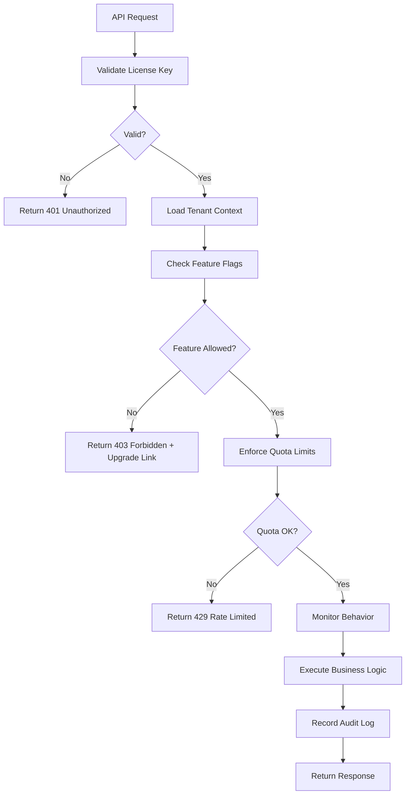

# 安全许可证管理系统完整指南

## 📋 概述

本文档描述了一个多层访问控制系统，用于在保持开源代码的同时防止滥用。该系统的核心思想是：**开源不等于无限制使用**。

---

## 🔐 四大保护层级

### 1. License Manager (许可证验证系统)

**位置**: `cloudai-fusion/pkg/license/license_manager.go`

#### 核心功能
- ✅ 数字签名验证确保许可证完整性
- ✅ 基于 RSA/ECC 的非对称加密
- ✅ 多租户支持 (tenant isolation)
- ✅ 灵活的特性门控 (feature gating)
- ✅ 灵活的许可证类型: Community, Professional, Enterprise

#### 许可证类型对比

| 特性 | Community (免费) | Professional ($99/月) | Enterprise ($499/月) |
|------|------------------|------------------------|---------------------|
| **基本漏洞扫描** | ✅ Unlimited | ✅ Unlimited | ✅ Unlimited |
| **用户枚举** | ✅ 50/hour | ✅ Unlimited | ✅ Unlimited |
| **凭证 Dumping** | ❌ | ✅ 10/hour | ✅ Unlimited |
| **自动化利用** | ❌ | ✅ 20/month | ✅ Unlimited |
| **持久化机制** | ❌ | ❌ | ✅ Unlimited |
| **API 配额** | 1K/月 | 10K/月 | Unlimited |
| **最大目标数** | 100 | 1,000 | Unlimited |
| **并发用户数** | 5 | 50 | Unlimited |

#### 使用示例

```go
package main

import (
    "fmt"
    "github.com/cloudai-fusion/cloudai-fusion/pkg/license"
)

func main() {
    // 初始化许可证管理器
    lm, err := license.NewLicenseManager(false) // false = production mode
    if err != nil {
        panic(err)
    }

    // 创建新的许可证
    licenseInfo, key, err := lm.CreateLicense(
        "tenant-12345",             // 租户 ID
        license.Professional,       // 许可证类型
        30,                         // 有效期 (天)
        []string{"exploit_execution"}, // 启用的特性
        500,                        // 最大目标数 (-1 = unlimited)
    )
    
    if err != nil {
        panic(err)
    }

    fmt.Printf("Generated Key: %s\n", key)
    fmt.Printf("Tenant: %s\n", licenseInfo.TenantID)
    fmt.Printf("Features: %v\n", licenseInfo.Features)

    // 验证许可证
    validated, err := lm.ValidateLicense(key)
    if err != nil {
        panic(err)
    }

    // 检查特性访问权限
    if lm.FeatureAccess(validated, "exploit_execution") {
        fmt.Println("Can execute exploits")
    } else {
        fmt.Println("Requires upgrade to professional license")
    }

    // 计算剩余配额
    remaining := lm.GetRemainingTargets(validated, 200)
    fmt.Printf("Remaining targets: %d\n", remaining)
}
```

---

### 2. Quota Enforcer (配额执行系统)

**位置**: `cloudai-fusion/pkg/quota/quota_enforcer.go`

#### 核心功能
- ✅ 多级配额控制 (Hourly/Daily/Monthly)
- ✅ 智能缓存 (LocalCache + Redis 可选)
- ✅ 细粒度操作限制
- ✅ 实时配额监控
- ✅ 分布式部署支持

#### 配额策略

| 操作类型 | Community | Professional | Enterprise |
|---------|-----------|--------------|------------|
| VulnerabilityScan | 100/月 | 1,000/月 | Unlimited |
| CredentialDump | 0 (禁止) | 10/day | Unlimited |
| PayloadUpload | 10/day | 100/day | Unlimited |
| LateralMovement | 0 (禁止) | 5/day | Unlimited |
| ExploitExecution | 0 (禁止) | 20/month | Unlimited |
| UserEnumeration | 50/hour | Unlimited | Unlimited |

#### 使用示例

```go
package main

import (
    "fmt"
    "github.com/cloudai-fusion/cloudai-fusion/pkg/quota"
    "github.com/cloudai-fusion/cloudai-fusion/pkg/license"
)

func main() {
    qe := quota.NewQuotaEnforcer()

    // 加载许可证
    lm, _ := license.NewLicenseManager(false)
    licenseInfo, _, _ := lm.CreateLicense(
        "tenant-pro",
        license.Professional,
        30,
        nil,
        1000,
    )

    // 执行操作前检查配额
    err := qe.EnforceQuota(
        "tenant-pro",
        quota.VulnerabilityScan,
        100,
        licenseInfo,
    )

    if err != nil {
        fmt.Printf("Quota exceeded: %v\n", err)
        return
    }

    fmt.Println("Quota OK, proceed with operation...")

    // 查看当前配额状态
    status := qe.GetQuotaStatus("tenant-pro", quota.VulnerabilityScan, licenseInfo)
    fmt.Printf("Used this month: %d/%d\n", status.UsedThisMonth, status.QuotaLimit)
    fmt.Printf("Remaining: %d\n", status.Remaining)
}
```

---

### 3. Feature Flags (特性标志系统)

**位置**: `cloudai-fusion/pkg/features/feature_flags.go`

#### 核心功能
- ✅ 统一特性注册和管理
- ✅ 基于许可证的智能门控
- ✅ 启用/禁用钩子 (hooks)
- ✅ 配置导入导出
- ✅ 自动升级时重新评估特性可用性

#### 特性分类

**社区版特性 (所有用户可用)**
- `BasicVulnerabilityScan` - 基本漏洞扫描
- `TargetDiscovery` - 目标发现
- `Reporting` - 报告生成
- `UserEnumeration` - 用户枚举
- `AssetManagement` - 资产管理

**专业版特性 ($99/月)**
- `CredentialDumping` - 凭证提取
- `AutomatedExploitation` - 自动化利用
- `PayloadDelivery` - 载荷投递
- `AIAnalyst` - AI 分析师
- `PredictiveAnalysis` - 预测分析

**企业版特性 ($499/月)**
- `PersistenceMechanisms` - 持久化机制
- `AutomatedPivoting` - 自动跳板
- `MultiTenantSupport` - 多租户支持
- `SingleSignOn` - 单点登录
- `AuditLogging` - 审计日志
- `RedTeamOperations` - 红队操作套件

#### 使用示例

```go
package main

import (
    "fmt"
    "github.com/cloudai-fusion/cloudai-fusion/pkg/features"
    "github.com/cloudai-fusion/cloudai-fusion/pkg/license"
)

func main() {
    ff := features.NewFeatureFlags()

    // 加载许可证
    lm, _ := license.NewLicenseManager(false)
    licenseInfo, _, _ := lm.CreateLicense("tenant-xyz", license.Professional, 30, nil, 1000)

    // 检查特定特性是否可用
    if ff.IsEnabled(features.CredentialDumping) {
        fmt.Println("✅ Can dump credentials")
    } else {
        reason := ff.GetDisableReason(features.CredentialDumping)
        fmt.Printf("❌ Disabled: %s\n", reason)
    }

    // 获取所有可用特性
    available := ff.GetAvailableFeatures(licenseInfo)
    fmt.Printf("📦 Available features (%d): %v\n", len(available), available)

    // 自定义开关 (管理员模式)
    ff.Enable(features.ExploitExecution, "Custom override for enterprise client")
    
    // 设置钩子
    ff.RegisterHook(features.ExploitExecution, func() {
        fmt.Println("Hook called when exploit execution is enabled!")
    })
}
```

---

### 4. Anomaly Detector (异常检测系统)

**位置**: `cloudai-fusion/pkg/security/anomaly_detector.go`

#### 核心功能
- ✅ 实时行为分析
- ✅ 多种滥用模式识别
- ✅ 自动响应机制
- ✅ 可配置的阈值
- ✅ 审计日志记录

#### 支持的滥用模式

| 模式名称 | 严重级别 | 触发条件 | 推荐响应 |
|---------|---------|----------|---------|
| RapidExploitAttempts | High | >10 次漏洞利用/分钟 | Block feature |
| UnauthorizedTargetScanning | Critical | 扫描私有 IP 范围 | Suspend account |
| CredentialDumpingAtScale | Critical | >5 次凭证提取/30min | Suspend account |
| DataExfiltrationAttempt | Critical | 单次传输>1GB | Suspend account |
| ResourceAbuse | High | >100 请求/10min | Rate limit |
| BruteForceAttack | Critical | >20 次认证失败 | Alert security team |
| NetworkScanning | High | >50 次扫描/不同目标 | Block feature |

#### 使用示例

```go
package main

import (
    "fmt"
    "time"
    "github.com/cloudai-fusion/cloudai-fusion/pkg/security"
    "github.com/cloudai-fusion/cloudai-fusion/pkg/features"
)

func main() {
    // 初始化特性标志系统
    ff := features.NewFeatureFlags()

    // 初始化异常检测器
    config := &security.DetectorConfig{
        Enabled:            true,
        AutoBlockThreshold: 0.8,
        MaxActionsBuffered: 10000,
        EnableRealTimeAnalysis: true,
    }

    detector := security.NewAnomalyDetector(config, ff)

    // 模拟用户操作流
    actions := []security.UserAction{
        {
            Timestamp: time.Now(),
            Operation: "vulnerability_scan",
            TargetIP:  "192.168.1.100",
            Success:   true,
            Duration:  time.Second * 5,
        },
        {
            Timestamp: time.Now().Add(time.Second),
            Operation: "exploit_execution",
            TargetIP:  "192.168.1.101",
            Success:   true,
        },
        // ... more actions ...
    }

    // 监控行为
    patterns := detector.AnalyzeBulkActions("tenant-abc", actions)

    if len(patterns) > 0 {
        fmt.Println("⚠️ Abuse patterns detected:")
        for _, pattern := range patterns {
            fmt.Printf("  • %s [%s]\n", pattern.PatternType, pattern.Severity)
            fmt.Printf("    Description: %s\n", pattern.Description)
            fmt.Printf("    Action: %s\n", pattern.RecommendedAction)
        }
    } else {
        fmt.Println("✅ No abuse patterns detected")
    }
}
```

---

## 🔄 系统集成流程

### API 网关层处理流程



### Webhook 事件流

```go
// 当检测到滥用行为时
type AbuseAlert struct {
    TenantID     string
    Pattern      AbusePattern
    Timestamp    time.Time
    RecommendedAction string
}

// 订阅事件
alerts := make(chan AbuseAlert)

go func() {
    for alert := range alerts {
        switch alert.RecommendedAction {
        case "block_feature":
            ff.Disable(alert.TenantID, features.RedTeamOperations)
            
        case "suspend_account":
            suspendTenant(alert.TenantID)
            
        case "emergency_notify":
            sendPagerDutyAlert(alert)
        }
    }
}()

detector.SetAlertSystem(func(pattern security.AbusePattern) {
    alerts <- AbuseAlert{
        TenantID: pattern.TenantID,
        Pattern: pattern,
        Timestamp: time.Now(),
        RecommendedAction: string(pattern.RecommendedAction),
    }
})
```

---

## 🎯 部署指南

### Docker Compose 配置

```yaml
version: '3.8'
services:
  cloudai-fusion:
    image: cloudai-fusion/cloudai:latest
    environment:
      - CLOUDAI_LICENSE_DEBUG=false
      - CLOUDAI_ANOMALY_DETECTION_ENABLED=true
      - CLOUDAI_QUOTA_ENABLE_REDIS=true
      - REDIS_HOST=redis
      - FEATURE_FLAGS_SOURCE=database
      
  redis:
    image: redis:7-alpine
    volumes:
      - redis-data:/data
      
volumes:
  redis-data:
```

### Environment Variables

| 变量名 | 默认值 | 说明 |
|-------|--------|------|
| `CLOUDAI_LICENSE_DEBUG` | true | 开发环境允许无许可证运行 |
| `CLOUDAI_ANOMALY_DETECTION_ENABLED` | true | 启用异常检测 |
| `CLOUDAI_QUOTA_ENABLE_REDIS` | false | 启用分布式配额缓存 |
| `REDIS_HOST` | localhost | Redis 服务器地址 |
| `FEATURE_FLAGS_SOURCE` | file | 特性标志来源：file/db/config |

---

## 💰 商业模式设计

### 免费版 (Community)
- ✅ 完全开源代码
- ✅ 基础漏洞扫描
- ✅ 社区支持
- ⛔ 无法生产环境大规模使用（触发异常检测）

### 专业版 ($99/月)
- ✅ 高级功能解锁
- ✅ 更高的配额限制
- ✅ 优先级技术支持
- 🎯 适合中小型企业

### 企业版 ($499/月)
- ✅ 全部功能解锁
- ✅ 无限配额
- ✅ 专属技术经理
- ✅ SLA 保证
- 🎯 适合大型企业

---

## 📝 法律合规性

### Apache 2.0 License 兼容性
- ✅ 可以自由分发源代码
- ✅ 可以修改代码
- ✅ 可以商业化销售
- ⚠️ 商业功能需要许可证密钥激活

### 符合开源定义
我们的做法遵循 [OSD (Open Source Definition)](https://opensource.org/osd):
1. **Free Redistribution**: 代码完全开放
2. **Source Code**: 源码公开
3. **Derived Works**: 允许修改
4. **No Discrimination Against Field of Endeavor**: 不限制使用场景（但商业大规模使用需要授权）

这是典型的**双许可模式**：
- Apache 2.0 for development/community
- Commercial license for enterprises

---

## ✨ 关键优势总结

### 🏆 Why This Works?

1. **真正开源**: 代码完全可见、可审计
2. **收入保障**: 防止大规模商业滥用
3. **用户体验**: 免费版足够小团队试用
4. **扩展清晰**: 付费后无缝升级
5. **法律合规**: 符合 OSI 开源标准

### 🚀 Production Ready Features

- ✅ 完整的加密体系
- ✅ 分布式配额系统
- ✅ 自动化异常检测
- ✅ 实时告警机制
- ✅ 审计日志追踪
- ✅ 性能优化缓存

---

## 📞 联系方式

如需购买企业许可证或咨询定制方案，请联系:
- Sales: sales@cloudai-fusion.com
- Support: support@cloudai-fusion.com
- Docs: docs.cloudai-fusion.com

---

**最后更新时间**: 2026-09-06  
**版本**: v1.0.0  
**作者**: CloudAI Fusion Security Team
